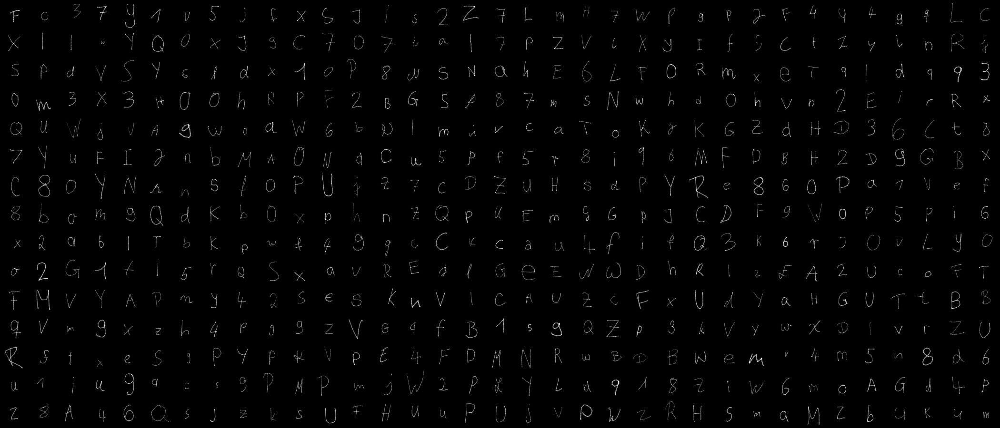
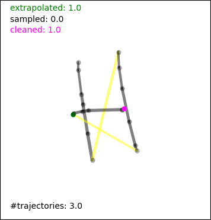

# Extending the Handwritten Character Omniglot Challenge



This dataset of naturally handwritten character trajectories extends the original sequential dataset of the Omniglot challenge presented in [Human-level concept learning through probabilistic program induction](https://science.sciencemag.org/content/350/6266/1332/) by Brenden M. Lake, Ruslan Salakhutdinov, and Joshua B. Tenenbaum, thereby bypassing its shortcomings, encoding the style of participants, leading to more variance within the characters, and including numbers, lowercase and uppercase letters. 


Table of Contents
=================

* [Repository structure](#repository-structure)
* [Hardware](#hardware)
   * [Tablet](#tablet)
* [Data](#data)
   * [Recording](#recording)
   * [Preprocessing](#preprocessing)
      * [Reading and writing](#reading-and-writing)
      * [Automated cleaning](#automated-cleaning)
      * [Missing pressure values: extrapolation and sampling](#missing-pressure-values-extrapolation-and-sampling)
   * [Misc](#misc)
      * [Plotting](#plotting)
      * [Pipeline](#pipeline)
      * [Checking](#checking)
   * [Complete participants](#complete-participants)
   * [Corrupted participants](#corrupted-participants)
* [Experiments](#experiments)
* [Citation](#citation)

## Repository structure

- `data/`:
    - `raw/`: original raw data
        - `complete/`: data for which all 5 instances of each symbol of the participants are usable
        - `corrupted/`: data for which that is not the case because of missing instances or similar problems
    - `preprocessed/`: preprocessed data, i.e. cleaned, extrapolated, and partially resampled (see below)
        - `complete/`: data for which all 5 instances of each symbol of the participants are usable
        - `corrupted/`: data for which that is not the case because of missing instances or similar problems
- `experiments/`:
    - `configs/`: configuration files for experiments
    - `data_transformer.py`: pickles dataset into single file
    - `dataset/`: provides pytorch dataset class
    - `examination.py`: produces DTW matrices and imitation measures
    - `experiments/`: contains the actual experiments
    - `main.py`: provides entry point to run experiments
    - `models/`: contains pytorch implementations of models
    - `util/`: provides utilities used during experiments
- `scripts/`:
    - `check.py`: shows where bounds, pressure, pen_downs, timestamps are not okay
    - `clean.py`: marks datapoints with pressure 0 as "cleaned"
    - `concat.py`: concatenates pickle files of multiple participants into single dataset
    - `data.py`: reads and writes data in original text and pickle file formats
    - `extrapolate.py`: if possible, extrapolates pressure values for points for which this information is missing
    - `pipeline.py`: puts reading, cleaning, extrapolation, sampling, and writing out together
    - `plot.py`: creates grid of instances
    - `sample.py`: samples pressure values for points for which this information is missing and cannot be extrapolated

Except for `data.py` and `pipeline.py` all scripts expect pickled data. Use `data.py` or `pipeline.py` to convert to pickled data.

All scripts can be run standalone by providing filenames via the commandline. Example:

`python scripts/plot.py data/preprocessed/complete/002-f-22-right_2019-06-05-12-21-29_preprocessed.pickle`

## Hardware

### Tablet ###

- Name: Wacom Intuos Pen Tablet CTH-490
- Size: 15.2cm x 9.5cm
- Resolution: 15200x9500

## Data

### Recording

For each participant, we recorded numbers 0-9, lowercase letters a-z and uppercase letters A-Z, in that order. Of each symbol we recorded five instances. Participants were advised to write in an authentic way, as they would do usually. They were free to add some variation. Furthermore, they were advised to try and keep their speed constant during the collection.

During recording paricipants saw a mainly black screen with a white square corresponding to a 2000x2000 square on the tablet. On the bottom, two buttons were presented, namely a redo and a next button. Participants were advised to write the symbol given on the redo button. If they liked their just produced instance of the symbol, they could either press the next button with the pen or a corresonding key on the keyboard. If they did not like the instance, they could press the redo button. The screen was cleared and they could try again.

After recording participants 001-036, we noticed that sometimes participants wrote the wrong symbols or pressed buttons too early while still writing. This sometimes led to corrupted data (which we filtered out), so we adjusted the script to avoid wasting further data. With this modification participants again saw the white square. On the right side of the screen, they furthermore saw the current symbol and five boxes. After writing instances of symbols and pressing the next button, these boxes were filled with the instances the participants produced. After five instances, participants had to press a different button, namely the confirm button, to be forwarded to the generation of the next symbol. Furthermore, they had the possibility to jump between their instances, clear, and rewrite them if desired. This way, much less wrong symbols were written by the participants and buttons were not pressed during writing anymore.

Original raw data can be found in `data/raw/`. There is one file for each participant. Each instance is represented by two lines. The first line contains the recorded datapoints. For each point, the x and y coordinates, the pressure, whether the pen was put down, and a relative timestamp are dumped to file, separated by whitespaces. The data of the different points is simply concatenated and again separated by whitespaces. The second line is a one-hot encoding of the symbol with a length of 62.

For each participant, we furthermore recorded their ID, age, gender, handedness, and the date of recording. This information is stored in the filename.

### Preprocessing

#### Reading and writing

Data reading and writing is done in `scripts/data.py`.

The original data format can be read with `read_original_data(filename)`. Upon reading, the input is parsed and stored in a dictionary. For each participant, the dictionary contains the ID (`wid`), gender (`gender`), age (`age`), handedness (`hand`), date of recording (`time`), the trajectories (`trajectories`), and the lengths of the trajectories (`lengths`). The trajectories are stored in a numpy-array of size (62, 5, 250, 8). This corresponds to 62 different symbols with 5 instances each, a maximum trajectory length of 250, as well as: x-coordinate, y-coordinate, pressure, pen_down, timestamp, if the point was marked as "cleaned" (to be ignored), if the point was extrapolated, and if the point was sampled (see below). The lengths are stored in a numpy-array of size (62, 5).

The length of the sequence per sample was variable, and the time difference between the steps was mostly at a small and semi-constant rate. Unfortunately, some samples have varying rates, causing a clustering of recorded time steps around one point and larger jumps before and after that point.

The dictionary produced by `read_original_data(filename)` can be processed by the other scripts. It can be written by `write_data(filename)` and read again by `read_data(filename)`.

In order to produce language-agnostic data files as well, `write_original_data(filename)` can be used to write processed data in a textfile format similar to the one produced during recording. It produces an additional file telling which datapoints were marked as cleaned, extrapolated, or sampled.

#### Automated cleaning

Automated cleaning is done in `scripts/clean.py`. The pens had buttons which, when pressed while the pen did not touch the tablet, procuded data points with pressure 0. These points are marked as "cleaned" automatically, as long as they did not have the pen_down flag set (see next section). This information is stored in the array `trajectories`. If, by this procedure, points are cleaned from the beginning of an instance, timestamps are adjusted accordingly. Points marked as "cleaned" are not considered for extrapolation or sampling, and do not have an impact on the statistics.

#### Missing pressure values: extrapolation and sampling

Extrapolation is done in `scripts/extrapolate.py`, sampling in `scripts/sample.py`. Due to a bug during recording, pressure values are sometimes overwritten with 0 when the pen was put down in the same moment. If possible, we linearly extrapolate the missing pressure value from the following two points. Sometimes, this is not possible because the pen was raised again. In these cases, we create a normal distribution from all points of that participant where the pen was put down and the pressure value was not overwritten with 0. We sample until we have a positive value in the 0.95 quantile of this distribution and use this value instead.

### Misc

#### Plotting

Plotting is done in `scripts/plot.py`. Lines between points are plotted in black, or yellow if the pen was put down on the second point. Points are plotted in magenta if marked as cleaned, in green if their pressure value was extrapolated, in blue if their pressure value was sampled, and in black otherwise. It furthermore shows the amount of cleaned, extrapolated, and sampled datapoints per instance as well as the number of continuous lines per instance.



#### Pipeline

Pipelining is done in `scripts/pipeline.py`. This script can be used the put together all the automated scripts. It produces pickle files for each provided dataset and one pickle file with all datasets concatenated.

#### Checking

Checking is done in `scripts/check.py`. This script shows which datapoints are out of bounds, have a pressure of 0 in the beginning of the trajectory, have no pen_down flag, have no pen_down flag on the first datapoint, have a timestamp of 0 which is not at the beginning of the trajectory, or have a timestamp which is not 0 at the beginning of the trajectory.

### Complete participants

All 5 instances of each symbol of the participants with the following IDs are considered complete. They can be found in the `data/raw/complete` directory.

```python
complete = ["002", "004", "005", "007", "008", "010", "012", "013", "018", "019", "020", "022", "025", "026", "030", "031", "032", "033", "036", "038", "040", "041", "043", "045", "049", "051", "053", "054", "055", "056", "057", "058", "060", "062", "064", "065", "066", "067", "068", "069", "070", "071", "072", "074", "075", "076", "077", "078", "079", "080", "081", "082", "083", "084", "085", "086", "087", "088", "089", "090", "091", "092", "093", "094", "095", "096", "098", "099", "100", "102", "103", "104", "105", "106", "107", "110", "111"]
```

### Corrupted participants

The following list shows for which participants instances are missing or similar problems arose. They can be found in the `data/raw/corrupted` directory.

```python
corrupted = ["003", "059", "073", "097", "101", "001", "006", "009", "011", "014", "015", "016", "017", "021", "023", "024", "027", "028", "029", "034", "035", "037", "039", "042", "044", "046", "047", "048", "050", "052", "061", "063", "108", "109"]
```

See `data/raw/corrupted/info` and `data/preprocessed/corrupted/info` (same content) for detailed information about which instances are corrupted and in which way.

## Experiments

Code for our experiments can be found in `experiments/`. All experiments are based on the clean, preprocessed data sequences: `data/preprocessed/complete/`. Please see the paper for more details.

## Citation

If you make use of this repository, please cite our work:

```
...
```
